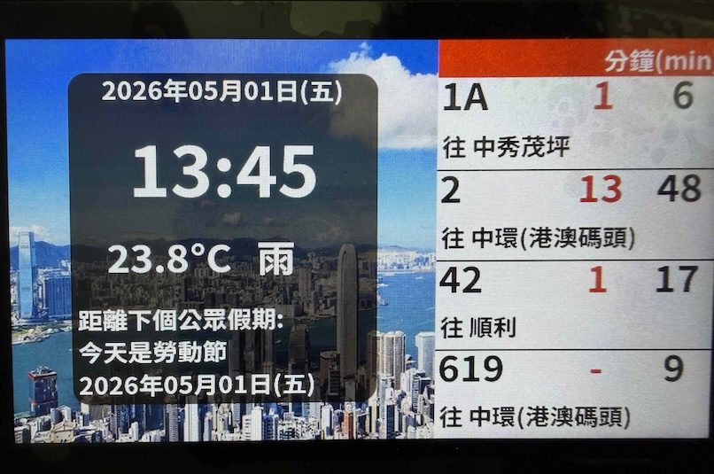
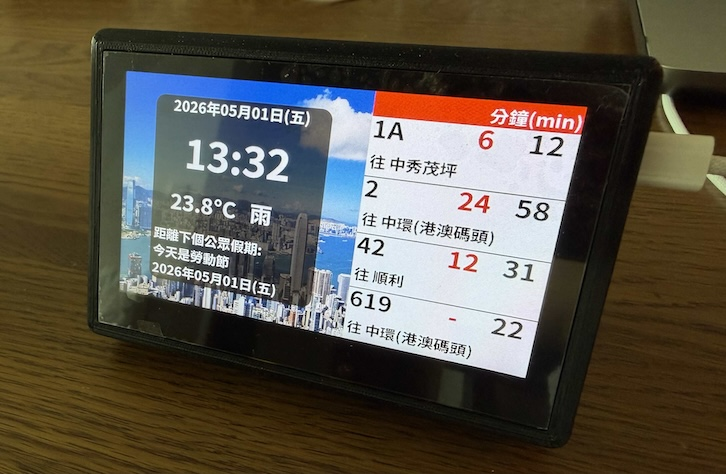
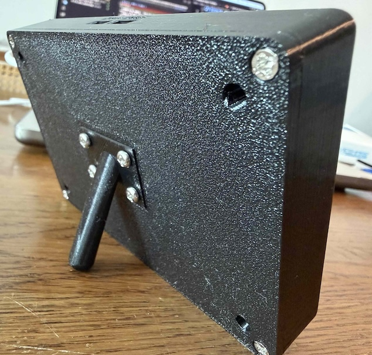

# HK Bus Stop ETA Monitor

Real-time Hong Kong bus arrival time display running on the **Waveshare ESP32-S3-Touch-LCD-4.3** — an all-in-one board with a 4.3" 800×480 IPS panel, capacitive touch (GT911), 16 MB flash, and 8 MB OPI PSRAM.



## Overview

This project turns the Waveshare ESP32-S3-Touch-LCD-4.3 board into a desk-side bus stop electronic arrival board. The UI is built with LVGL 8.4 (SquareLine Studio) directly on the on-board LCD — no external Nextion HMI required. All configuration lives on a captive web portal hosted by the device itself.

It fetches live ETA data from:

- KMB (九巴) — `data.etabus.gov.hk`
- Citybus (城巴) — `rt.data.gov.hk` (V1 batch endpoint)

Background changes through the day (day / sunset / night), and the panel can be put on a programmable sleep schedule with touch-wake.

The display shows:

- Current time, date, and weekday
- Hong Kong public holiday countdown
- Real-time temperature + weather icon (Open-Meteo)
- Up to 4 bus routes per page with smart ETA (`-`, `<1`, or minutes)
- Auto slideshow every 5 seconds; tap the right-side hotspot to advance manually

## Features

- **Multi-stop ETA** — pick any number of KMB and Citybus stops via the web UI; the device cycles through every selected stop on the slideshow.
- **Captive web settings portal** — Wi-Fi, stops, schedule, and language all configurable from a browser (`/api/config`, `/api/reboot` in [src/WebPortal.cpp](src/WebPortal.cpp)).
- **Map-based stop picker** — interactive Leaflet + OpenStreetMap view with all KMB / CTB stops as clickable pins. **No API key required**, all assets bundled in LittleFS.
- **Live "routes at this stop" view** — ⓘ button on every selected stop opens a modal listing every route that serves that stop, with destination. Live for KMB (via `/stop-eta/{id}`), cached for CTB.
- **Multi-language UI** — settings page in English or 繁體中文; auto-detects browser locale on first visit, persists choice in `localStorage`. Bus stop names always come from the API in Chinese (the underlying data).
- **Programmable sleep schedule** — repeating "wake at" / "sleep at" tasks per weekday; the device deep-sleeps between scheduled windows. Touch-wake grace period (1 / 2 / 5 / 10 / 30 minutes) lets the user glance at the screen mid-sleep.
- **Dynamic Citybus route/stop discovery** — no hardcoded route lists; the browser builds the full stop list once with a 60 s cooldown and a 2 h rate-limit gate to protect the upstream API.
- **AP-mode fallback** — device starts its own Wi-Fi AP if it can't join the configured network ([src/Wireless.cpp](src/Wireless.cpp)).
- **Smart ETA display** — `-` means arriving soon / not in service, `<1` means less than a minute, otherwise minutes. Both inbound and outbound directions shown when available.
- Routes auto-sorted by route number; destinations prefixed with `往` (toward) when present.
- Public holiday countdown loaded from `data/holiday.json`.
- NTP time sync (Hong Kong timezone, UTC+8).
- **PSRAM-bus optimised for the RGB panel** — internal-RAM ArduinoJson allocator, HTTP keep-alive for CTB, plain HTTP for KMB, field-filtered JSON parsing — all to keep the PSRAM bus quiet for the LCD scanout DMA so the panel doesn't drift during fetches.

## Hardware

- **Board**: [Waveshare ESP32-S3-Touch-LCD-4.3](https://www.waveshare.com/esp32-s3-touch-lcd-4.3.htm)
  - ESP32-S3-N16R8 (16 MB flash, 8 MB OPI PSRAM)
  - 4.3" 800×480 IPS panel via 16-bit RGB parallel interface
  - GT911 capacitive touch over I²C (INT on GPIO 4 — also the deep-sleep wake source)
  - CH422G IO expander (drives backlight, LCD reset, touch reset)
- **Power**: USB-C (5 V, ~400 mA)
- **No external display** — the LCD is on-board.

## Enclosure (3D-printed case)

A 3D-printable case with a desk stand has been designed for this build. The STEP sources are in the repo so you can adapt them in any CAD tool before slicing.

| Front | Back |
| --- | --- |
|  |  |

Download the STEP files from [`3D print/`](3D%20print/):

- [`ETA_Mon_Case.step`](3D%20print/ETA_Mon_Case.step) — main enclosure (front shell that holds the panel)
- [`ETA_Mon_Back_plate.step`](3D%20print/ETA_Mon_Back_plate.step) — rear plate covering the board
- [`ETA_Mon_Stand.step`](3D%20print/ETA_Mon_Stand.step) — desk stand

## Repository Structure

```text
include/
└── esp_panel_board_custom_conf.h   # ESP32_Display_Panel board config
src/
├── main.cpp                # setup(), loop(), networkTask, webPortalTask
├── Display.cpp / .h        # LVGL widget glue (Update_Time, Update_Bus_List, ...)
├── lvgl_v8_port.cpp / .h   # LVGL ↔ ESP32_Display_Panel adapter
├── ui/                     # SquareLine Studio generated UI
│   ├── ui_Main.c           # Widget tree
│   ├── ui_font_NSTC*.c     # NotoSans TC fonts (28/44/80 px)
│   └── ui_img_*.c          # Background images (day / sunset / night)
├── BusData.cpp / .h        # KMB + Citybus ETA fetching
├── WeatherData.cpp / .h    # Open-Meteo weather
├── HolidayData.cpp / .h    # Holiday JSON loading + countdown
├── ConfigManager.cpp / .h  # Persisted config (Wi-Fi, stops, schedule)
├── Wireless.cpp / .h       # Wi-Fi STA + AP-mode fallback
├── WebPortal.cpp / .h      # HTTP server: /api/config, /api/reboot, static
├── Sleep.cpp / .h          # Deep-sleep scheduler + GT911 touch wake
├── JsonInternal.h          # Internal-RAM ArduinoJson allocator
└── Diagnostics.cpp / .h    # Heap_Log helper
data/
├── index.html              # Captive web settings portal
├── favicon.ico             # 32×32 favicon
├── leaflet.{js,css}        # Leaflet 1.9.4 (bundled, no CDN)
├── leaflet.markercluster.js
├── MarkerCluster*.css
├── config.json             # Runtime config (created from .template)
└── holiday.json            # 2026 Hong Kong public holidays
partitions_16MB_littlefs.csv  # Custom 16 MB partition (7 MB app × 2 + 2 MB FS)
```

## Dependencies

PlatformIO libraries (pinned in `platformio.ini`):

- [`ESP32_Display_Panel`](https://github.com/esp-arduino-libs/ESP32_Display_Panel) — board / panel / touch driver
- [`ESP32_IO_Expander`](https://github.com/esp-arduino-libs/ESP32_IO_Expander) — CH422G driver
- `esp-arduino-libs/esp-lib-utils @ ^0.3.0`
- `lvgl/lvgl @ ^8.4.0`
- `bblanchon/ArduinoJson @ ^7.2.0`

## Configuration

Everything except the AP credentials is configured at runtime through the captive web portal — see [TUTORIAL.md](TUTORIAL.md) for a full walkthrough.

### Bootstrap config (one-time, before first flash)

Before flashing, seed the device with at least the **AP credentials** so you can reach the captive portal when it falls back to AP mode.

1. Rename the template:

   ```bash
   cp data/config.json.template data/config.json
   ```

2. Edit `data/config.json`:

   ```jsonc
   {
     "wifi": {
       "ssid": "YOUR_WIFI_SSID",         // optional — set later in the portal
       "password": "YOUR_WIFI_PASSWORD"  // optional
     },
     "ap": {
       "ssid": "BusETAMonitor-AP",       // REQUIRED
       "password": "12345678"            // REQUIRED — ≥ 8 characters
     },
     "stops": {
       "kmb": [],                        // optional — pick stops in the portal
       "ctb": []
     },
     "sleep_schedule": {
       "wake_tasks": [],                 // optional — set in the portal
       "sleep_tasks": [],
       "grace_period_minutes": 5
     }
   }
   ```

3. Upload to LittleFS:

   ```bash
   pio run -t uploadfs
   ```

   The same command also uploads `index.html`, `holiday.json`, the Leaflet bundle, and the favicon — re-run any time you edit anything under `data/`.

> `data/config.json` is your local secrets file (it can hold your home Wi-Fi password). It is **not** intended to be committed to the repo — only `data/config.json.template` should be tracked.

### First boot

If the device cannot join the saved Wi-Fi (or none is configured), it falls back to AP mode. Connect your phone or laptop to the AP advertised by the device, then open `http://192.168.4.1` in a browser.

Once the device is on your home Wi-Fi, the same page is reachable at the device's IP, which the LCD displays in a scrolling banner for 2 minutes after every boot.

## Build & Upload

```bash
# 1. Upload data/ to LittleFS (settings page, leaflet, favicon, holidays)
pio run -t uploadfs

# 2. Build & upload firmware
pio run -t upload

# 3. Build only
pio run

# Optional — wipe flash (e.g. after changing the partition table)
pio run -t erase
```

The custom partition table `partitions_16MB_littlefs.csv` provides 7 MB per app slot (dual OTA) + ~2 MB LittleFS. If you change it, run `pio run -t erase` once before the next upload so the bootloader re-reads the partition map.

## Notes

- Slideshow advances every **5 seconds**. Tap the right-side hotspot on the panel to advance manually.
- Wi-Fi info banner shows on the LCD for **2 minutes** after every boot, then auto-hides.
- If Wi-Fi fails, the board keeps running with the last cached ETAs; weather + ETA fetches resume automatically when the link returns.
- Holiday display refreshes once per hour; backgrounds switch at 06:00 (day), 17:00 (sunset), 18:30 (night).
- Weather refreshes every 30 minutes; bus ETAs every 45 seconds.
- The deep-sleep scheduler wakes from either a configured timer or a screen touch (GT911 INT on GPIO 4).

## License

This project is released under the **Creative Commons Attribution-NonCommercial 4.0 International** licence ([CC BY-NC 4.0](https://creativecommons.org/licenses/by-nc/4.0/)).

You are free to:

- **Use, copy, modify, and redistribute** the source, the 3D-printable STEP files, and the documentation,
- for **personal, educational, and other non-commercial** purposes,
- as long as you give appropriate credit (link back to this repo).

You **may not** use this work — in whole or in part — for **commercial** purposes (selling assembled units, paid services built on this code, or any other commercial offering) without prior written permission from the author. If you'd like to discuss a commercial use, please open an issue first.
