# Web Settings Page — User Guide

A walkthrough of the captive web portal used to configure the HK Bus ETA Monitor: language, Wi-Fi, the stop list cache, three ways to pick bus stops, the routes-at-stop view, the sleep schedule, save / reboot, and the rebuild cooldown / rate-limit gate.

---

## 1. Opening the settings page

The device serves the settings page on port 80 in both Wi-Fi modes:

- **First boot or after a Wi-Fi join failure** — the device falls back to AP mode (see [src/Wireless.cpp](src/Wireless.cpp)). Connect your phone or laptop to the AP advertised by the device, then open `http://192.168.4.1`.
- **Normal operation** — the device joins your home Wi-Fi as a station. Open `http://<device-ip>` (the IP appears on the device's LCD — see below).

### Finding the IP on the LCD

The firmware shows a **scrolling Wi-Fi info banner** on the LCD for the first **2 minutes** after every boot:

- **STA mode**: `WiFi:<ssid>  IP:<ip>`
- **AP mode**: `AP:<ssid>  P:<password>  IP:<ip>`

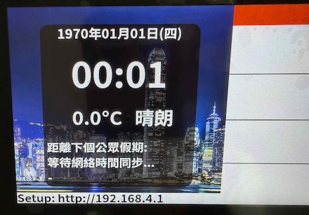

After 2 minutes the banner disappears so it doesn't clutter the ETA display. If you miss it, just power-cycle the device — the banner reappears for another 2 minutes after every boot.

You should see the page below.

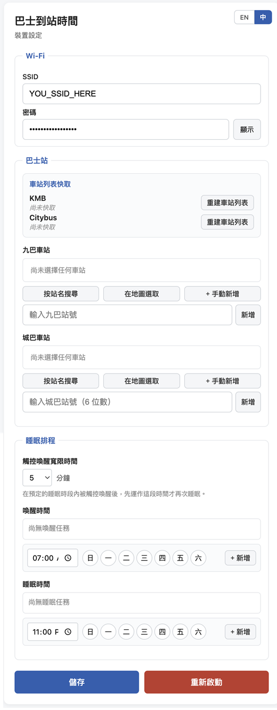

---

## 2. Switching language

The top-right of the card has a small **EN / 中** toggle. The page auto-detects your browser's language on first visit (anything starting with `zh` → 繁體中文, otherwise English) and persists your choice in `localStorage`.

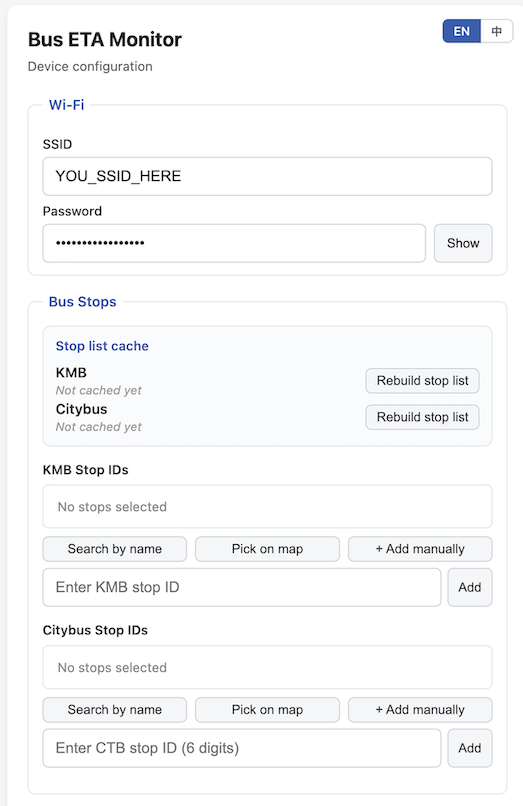

> Bus stop names are **not** translated — they always come from the operator's API in Chinese (the source field is `name_tc`). Only the UI chrome flips when you switch language.

---

## 3. Wi-Fi setup

Fill in the **SSID** and **Password** of the network you want the device to join. Click **Show** next to the password to reveal what you typed; click **Hide** to mask it again.

> Wi-Fi changes do **not** take effect immediately — you must press **Save** and then **Reboot** before the device tries the new credentials.

---

## 4. Stop list cache

A separate **Stop list cache** card sits at the top of the Bus Stops section. It shows, at a glance:

- Whether the cache is built for each operator
- The total stop count and last-built timestamp
- A **Rebuild stop list** button per operator with the same 60 s cooldown and 2 h rate-limit gate (see §8)

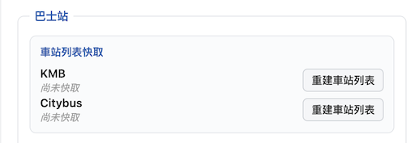

To use search or map-based stop picking, you need the cache built. KMB ships its full stop list at one endpoint (~6,800 stops, ~5 s build); CTB has no single endpoint, so the page builds it in three phases:

1. Fetch the route list (`/route/CTB`)
2. For each route × direction, fetch the route-stop list
3. For each unique stop, fetch the stop name + coordinates + per-route metadata

Expect CTB's first build to take a few minutes. Watch progress in the per-row status line.

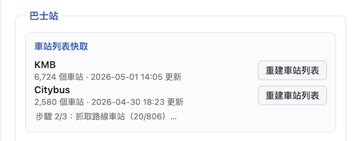

The cache is stored in your browser's `localStorage` — it's a one-time cost per browser. Both caches now also carry stop coordinates (used by the map view) and CTB carries per-stop route info (used by the routes-at-stop view).

---

## 5. Picking bus stops

Each operator (KMB and Citybus) has the same row of three buttons under its label:

| Button | What it does |
| --- | --- |
| **Search by name** | Type any part of the Chinese stop name; live results from the cache. |
| **Pick on map** | Open an interactive map — pan / zoom, tap any pin to add. |
| **+ Add manually** | Type a known stop ID directly. Useful if you copied it from a URL. |

You can mix all three. Selected stops appear in the list above the buttons; click the red **×** on a row to remove a stop, click **ⓘ** to view the routes that serve it (see §6).

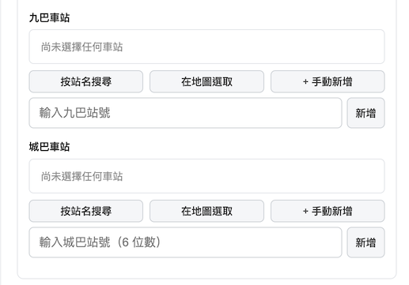

### 5a. Search by name

Open the search panel with **Search by name**, type any substring of the Chinese stop name, click any row to add.

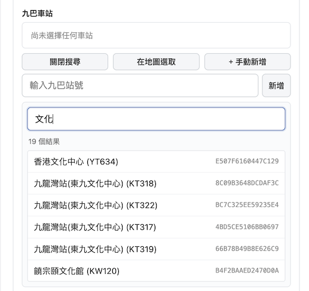

You can add **as many stops as you want** for both KMB and Citybus — the device cycles through every selected stop on the slideshow.

### 5b. Pick on map (new)

Open with **Pick on map**. The map opens centred on Hong Kong with all stops as clustered pins (numbered cluster bubbles when zoomed out, individual pins when zoomed in). Tap a pin → a popup shows the stop name and ID with **Add this stop** and **View routes** buttons.

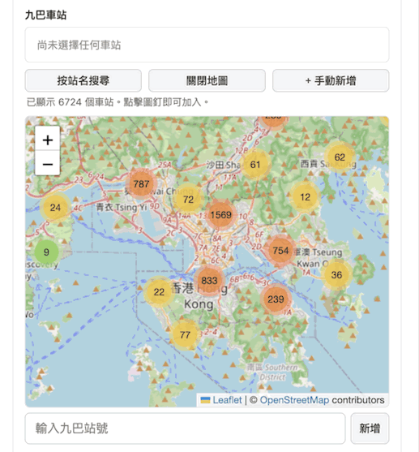

The map uses Leaflet + OpenStreetMap tiles — **no API key required**, but the browser does need internet for the tile downloads. The Leaflet library itself is bundled in LittleFS.

> Already-selected stops appear in green on the map; unselected pins are blue. If tiles fail to load (e.g. you're connected only to the device's AP), a banner appears suggesting you fall back to **Search by name**.

### 5c. Add manually

Click **+ Add manually** under the operator section, type the stop ID, click **Add**.

- KMB IDs look like `904DEAF7441E3BB8` (16-char hex).
- CTB IDs are 6 digits, e.g. `001027`.

Manually-added stops show "(unresolved)" until the relevant cache is built — but they still work; the firmware queries by ID, not by name.

---

## 6. Viewing routes for a stop (new)

Each row in your selected-stops list has an **ⓘ** button (between the stop name and the red **×**). Click it to see every route that serves that stop, with destination.

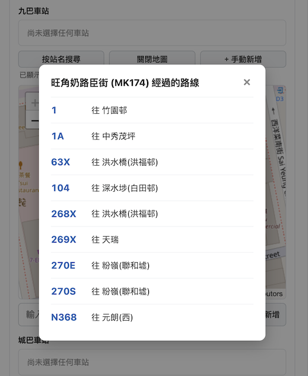

- For **KMB**, this fetches `/v1/transport/kmb/stop-eta/<id>` live, so the route list reflects current service.
- For **CTB**, this reads from the cache built earlier (CTB has no per-stop ETA endpoint that returns routes; you need the cache up-to-date — if it isn't, the modal tells you to rebuild first).

The same modal opens from the map popup's **View routes** button.

---

## 7. Sleep schedule (new)

A separate **Sleep Schedule** fieldset configures when the device deep-sleeps and wakes:

- **Touch-wake grace period** — when you tap the screen during a scheduled sleep window, the device wakes up and runs for this long before re-sleeping. Choices: 1 / 2 / 5 / 10 / 30 minutes.
- **Wake at** — list of repeating times the device should wake. Each task is `HH:MM` plus a set of weekdays (日 一 二 三 四 五 六).
- **Sleep at** — list of repeating times the device should enter deep sleep.

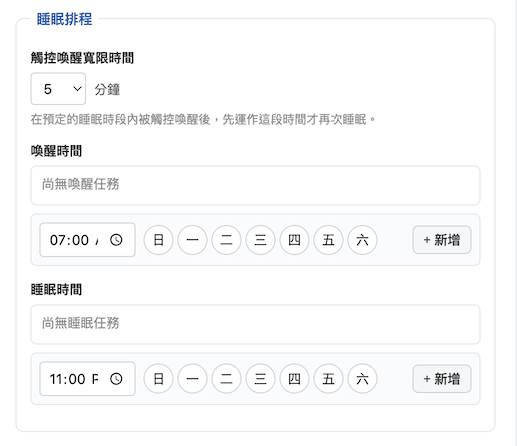

Click the day circles to toggle weekdays (blue = active). Click **+ Add** to commit a task to the list; click the red **×** on a row to remove it.

### How the schedule is interpreted

The device computes the most recent past sleep-task and the most recent past wake-task. If the most recent event was a sleep, it deep-sleeps until the next wake-task time. If the most recent event was a wake, it runs until the next sleep-task time.

Touch-wake during a sleep window grants you the configured grace period before the device re-sleeps — handy for a quick glance.

> Schedule changes do **not** require a reboot — they're picked up on the next loop tick. Wi-Fi changes still do.

---

## 8. Rebuild cooldown and rate-limit gate

The KMB and Citybus APIs both rate-limit aggressive callers. The page has two protections.

### 60-second cooldown

After every rebuild — successful or failed — the **Rebuild stop list** button is disabled for 60 seconds and shows a live countdown:

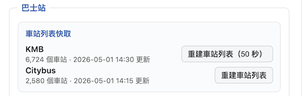

This applies to KMB and CTB independently.

### 2-hour cache-age gate

If you click **Rebuild stop list** while the cache is younger than 2 hours, a confirm dialog tells you exactly how recent the cache is and warns about API rate-limiting:

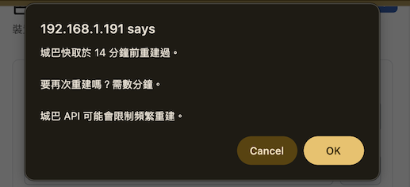

> **Why this matters.** When `data.gov.hk` rate-limits a request it returns `HTTP 403` *without* CORS headers. The browser surfaces this as a confusing CORS error in the console even though the real cause is throttling. The cooldown and gate are there so you don't trip into that state by accident.

Stop lists rarely change — rebuild only when you genuinely need newer data (e.g. a new route opened).

---

## 9. Saving configuration

Click **Save** to persist Wi-Fi credentials, the selected stop lists, and the sleep schedule to flash. The page POSTs to `/api/config` and the firmware writes to LittleFS ([src/WebPortal.cpp](src/WebPortal.cpp)).

| Change | Takes effect |
| --- | --- |
| Stop selection | next ETA refresh (≤ 45 s) — no reboot |
| Sleep schedule (incl. grace period) | next loop tick — no reboot |
| Wi-Fi credentials | requires **Reboot** |

---

## 10. Rebooting the device

Click **Reboot** and confirm:

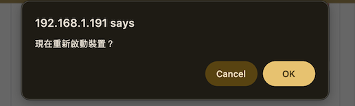

The page shows a 5-second countdown and refreshes itself when the device comes back up:

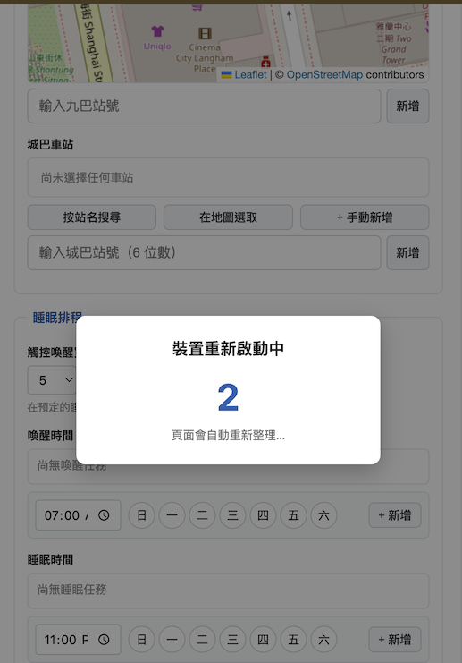

If you changed Wi-Fi credentials, the device may now be on a different network — re-open the page at the new IP shown on the LCD (the banner reappears for 2 minutes after every boot).
